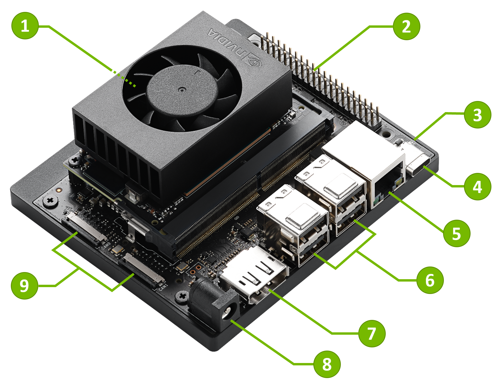
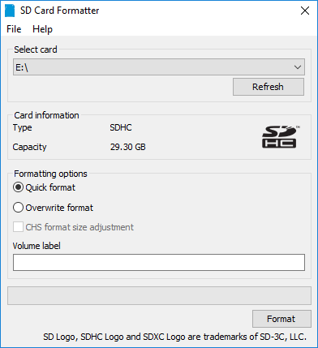
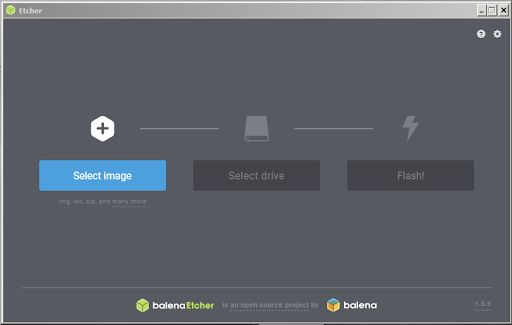
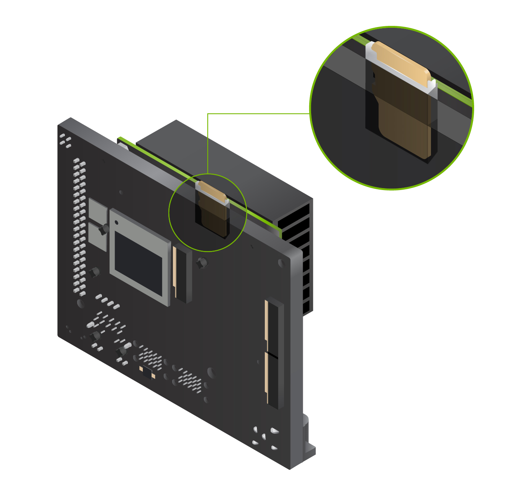
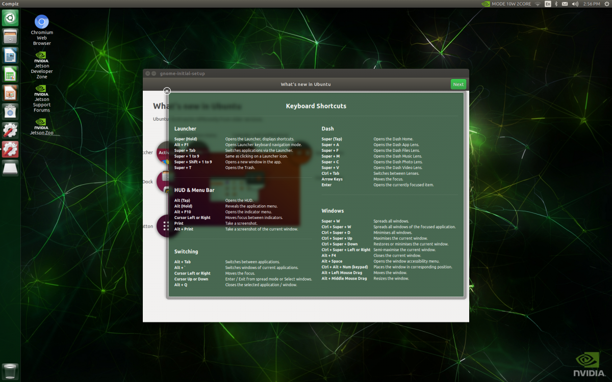

# Jetson Orin Nano Developer Kit Getting Started Guide

## Outline

- [Jetson Orin Nano Developer Kit Getting Started Guide](#jetson-orin-nano-developer-kit-getting-started-guide)
  - [Outline](#outline)
- [Introduction](#introduction)
  - [Included in the Box](#included-in-the-box)
  - [Items not Included](#items-not-included)
- [Write Image to the microSD Card](#write-image-to-the-microsd-card)
- [Setup and First Boot](#setup-and-first-boot)
  - [Setup Steps](#setup-steps)
  - [First Boot](#first-boot)
  - [After Logging In](#after-logging-in)
- [Next Steps](#next-steps)
- [Another Related Topics](#another-related-topics)

# Introduction

The [NVIDIA® Jetson Orin Nano™ Developer Kit](https://www.nvidia.com/en-us/autonomous-machines/embedded-systems/jetson-orin/) enables development of AI-powered robots, smart drones, and intelligent cameras based on the Jetson Orin Nano series.

1. microSD card slot for main storage
2. 40-pin expansion header
3. Power indicator LED
4. USB-C port for data only
5. Gigabit Ethernet port
6. USB 3.1 Type A ports (x4)
7. DisplayPort connector
8. DC Barrel jack for 19V power input
9. MIPI CSI camera connectors

## Included in the Box

- Jetson Orin Nano module with microSD card slot
- Reference carrier board (includes 802.11 plug-in WLAN & BT module preinstalled with antenna)
- 19V power supply
- A small paper card with quick start and support information

## Items not Included

You’ll also need:

- microSD card (64GB UHS-1 or bigger recommended)
- USB keyboard and mouse
- Computer display (DP)
- USB-C cable

> **Initially, a computer with Internet connection and the ability to flash your microSD card is also required.**

# Write Image to the microSD Card

To prepare your microSD card, you’ll need a computer with Internet connection and the ability to read and write SD cards, either via a built-in SD card slot or adapter.

1. Download the [Jetson Orin Nano Developer Kit SD Card image](https://developer.nvidia.com/downloads/embedded/l4t/r35_release_v3.1/sd_card_b49/jp511-orin-nano-sd-card-image.zip/), and note where it was saved on the computer. You also check out the latest JetPack features and resources at the [JetPack SDK page](https://developer.nvidia.com/embedded/jetpack).
2. Write the image to your microSD card by following the instructions below according to the type of computer you are using: Windows, Mac, or Linux.

<strong>INSTRUCTIONS FOR WINDOWS</strong>

Format your microSD card using SD Memory Card Formatter from the SD Association.

1. Download, install, and launch [SD Memory Card Formatter for Windows](https://www.sdcard.org/downloads/formatter_4/eula_windows/).
2. Select card drive
3. Select “Quick format”
4. Leave “Volume label” blank
5. Click “Format” to start formatting, and “Yes” on the warning dialog

Use Etcher to write the Jetson Nano Developer Kit SD Card Image to your microSD card

1. Download, install, and launch [Etcher](https://www.balena.io/etcher).
2. Click “Select image” and choose the zipped image file downloaded earlier.
3. Insert your microSD card if not already inserted.
   > Click Cancel (per [this explanation](https://github.com/balena-io/etcher/issues/2024)) if Windows prompts you with a dialog like this:

4. Click “Select drive” and choose the correct device.

5. Click “Flash!” It will take Etcher about 10 minutes to write and validate the image if your microSD card is connected via USB3.
6. After Etcher finishes, Windows may let you know it doesn’t know how to read the SD Card. Just click Cancel and remove the microSD card.

After your microSD card is ready, proceed to [set up your developer kit](#setup-and-first-boot).

# Setup and First Boot

## Setup Steps

1. Insert the microSD card (with system image already written to it) into the slot on the underside of the Jetson Orin Nano module.
2. Power on your computer display and connect it.
3. Connect the USB keyboard and mouse.
4. Connect the provided power supply. The Jetson Orin Nano Developer Kit will power on and boot automatically.

## First Boot

A green LED next to the USB-C connector will light as soon as the developer kit powers on. When you boot the first time, the Jetson Orin Nano Developer Kit will take you through some initial setup, including:

- Review and accept NVIDIA Jetson software EULA
- Select system language, keyboard layout, and time zone
- Connect to Wireless network
- Create username, password, and computer name
- Log in

## After Logging In

You will see this screen. Congratulations!

# Next Steps

<h2>Find Your Way Around</h2>

- Read the [Jetson Orin Nano Developer Kit User Guide](https://developer.nvidia.com/embedded/learn/jetson-orin-nano-devkit-user-guide/index.html), which includes:
  - Many more details about the developer kit hardware
  - Overview of NVIDIA JetPack, and ways to flash the developer kit
- Head to the [NVIDIA Jetson Developer site](https://developer.nvidia.com/jetson) for access to all Jetson platform information.
- Ask questions or share a project on the [NVIDIA Jetson Forums](https://forums.developer.nvidia.com/c/agx-autonomous-machines/jetson-embedded-systems/70).

# Another Related Topics

- [ArduCam: Nvidia Jetson Camera](docs/arducam/nvidia-jetson-camera.md)
- [Jetson-stats: Simple package for monitoring and control your NVIDIA Jetson](https://github.com/rbonghi/jetson_stats)
