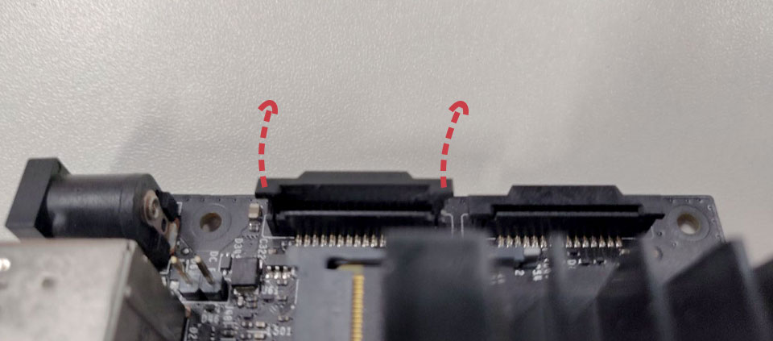
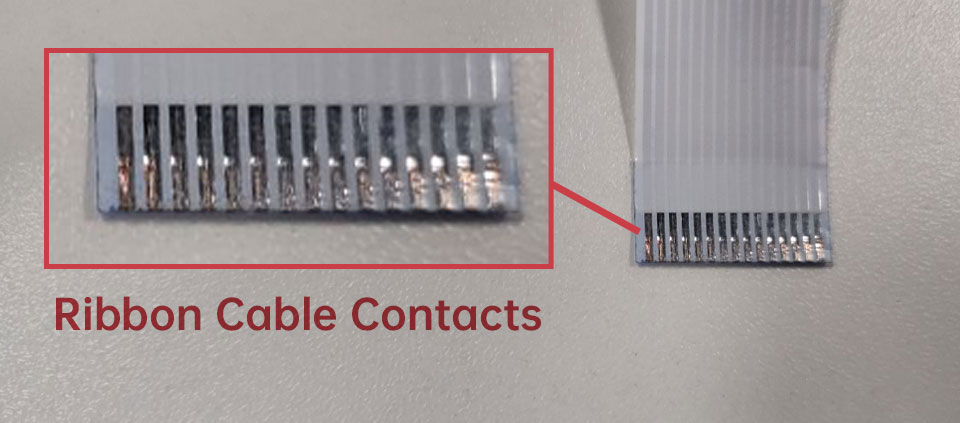
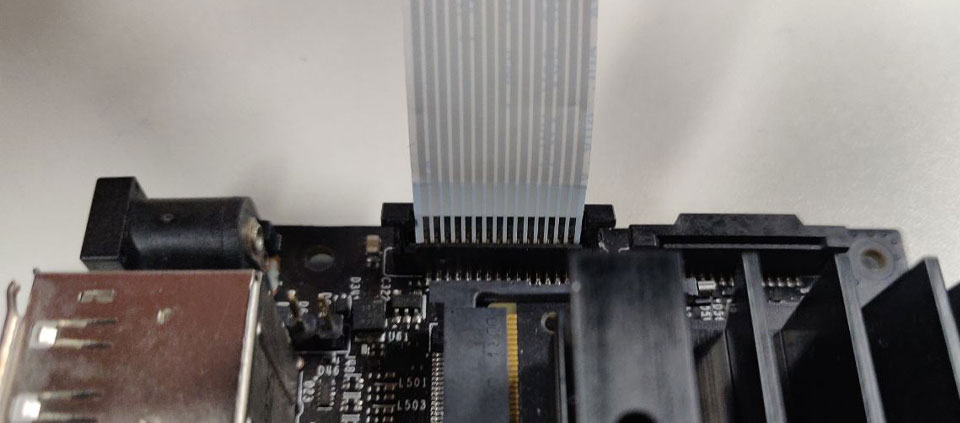
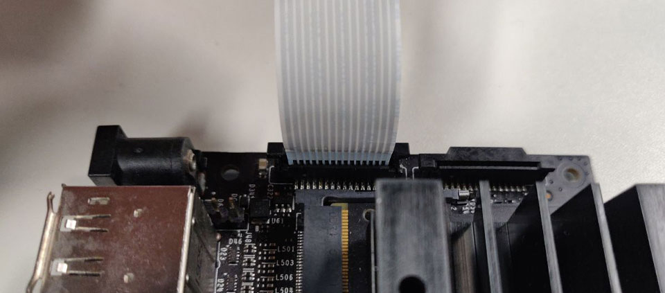

# Introduction to Arducam Jetson Cameras

## Native Jetson Cameras – IMX219/IMX477

Jetson Nano and Xavier NX natively support IMX219 with the well-tuned ISP, and then followed by IMX477. So it is suggested to use the native camera driver for best performance and image quality. For IMX219, the camera driver and device tree are ready after a fresh installation of the official image. But for recently released IMX477 camera, you have to install the driver package manually to replace the IMX219 driver.

The native IMX219 has a fixed focus lens, either glued or should be manually adjusted. Arducam designed a motorized focus IMX219 camera module which lens can be programmable controlled through software. In the [IMX219 GitHub folder](https://github.com/ArduCAM/MIPI_Camera/tree/master/Jetson/IMX219), it contains the software script to control the Arducam motorized focus IMX219 camera module for manual focus or autofocus.

The [IMX477 GitHub folder](https://github.com/ArduCAM/MIPI_Camera/tree/master/Jetson/IMX477/driver) contains the Jetson Nano/Xavier NX driver package for different kernel versions.

## Jetvariety Cameras

Jetvariety is an Nvidia Jetson platform V4L2 kernel camera driver framework that can support any MIPI cameras Arducam provides which are not natively supported by the Jetson – cameras other than IMX219 and IMX477.

A single-camera driver for all is the main goal of the Jetvariety project, the users don’t need to develop their own camera driver for Nvidia Jetson boards and even more, users can switch between different Arducam cameras without switching camera driver. Software compatibility for the Jetvariety V4L2 driver is also another consideration for this project. Arducam_OBISP_MIPI_Camera_Module uses this driver on Jetson.

## Multi-Camera Solution

Using Arducam multi-camera adapter board, it allows users to connect 4 cameras for each CSI camera port. For Jetson Nano or Xavier NX develop kit, there are two CSI camera ports, so maximum 8 cameras can be connected with two Arducam multi-camera adapter board connected. All of these cameras connected to a single CSI port, only one camera is allowed to be activated at a time. Users should switch between cameras through GPIO control.

## PTZ Camera

PTZ means Pan/Tilt/Optical Zoom, it is an add-on feature for native Jetson cameras like IMX219 using the Arducam PTZ camera adapter board. Users can use Arducam opensource software script to control the camera’s Pan/Tilt and optical zoom/focus.

## Supported Jetpack Versions

Official Nano Development Kit

> **Note**: The camera-related driver packages we released before JetPack `32.6.1` are no longer maintained

|  JetPack Version  | 32.4.3 | 32.4.4 | 32.5.0 | 32.5.1 | 32.5.2 | 32.6.1 | 32.7.1 | 32.7.2 |
| :---------------: | :----: | :----: | :----: | :----: | :----: | :----: | :----: | :----: |
|    **IMX477**     |   ✅   |   ✅   |   ✅   |   ✅   |   ✅   |   ✅   |   ✅   |   ✅   |
| **IMX477-stereo** |   ✅   |   ✅   |   ✅   |   ✅   |   ✅   |   ✅   |   ✅   |   ✅   |
|    **IMX519**     |   ❌   |   ❌   |   ❌   |   ❌   |   ❌   |   ✅   |   ✅   |   ✅   |
|  **Jetvariety**   |   ✅   |   ✅   |   ✅   |   ✅   |   ✅   |   ✅   |   ✅   |   ✅   |

# Native Camera

## 8MP IMX219

### Introduction

IMX219 is a 1/4″ 8MP MIPI CSI-2 image sensor, it was adopted by the Raspberry pi V2 camera module back in 2016. Now the IMX219 camera is natively supported by the Jetson Nano and Xavier NX out of the box.

[View more product details](https://docs.arducam.com/Nvidia-Jetson-Camera/Native-Camera/imx219/)

## 12MP IMX477

### Introduction

Arducam just released this High Quality camera module for Jetson Nano/Xavier NX/Raspberry Pi Compute Module CM4, CM3, CM3+, an IMX477 camera board with three hole pitches, a 6mm CS lens.The customers can use this camera module on Jetson Nano/Xavier NX/Raspberry Pi Compute Module CM4, CM3, CM3+ natively with hardware ISP features.

[View more product details](https://docs.arducam.com/Nvidia-Jetson-Camera/Native-Camera/imx477/)

## 16MP IMX519

### Introduction

Based on the 16MP Sony IMX519 sensor, Arducam released a series of 16MP cameras for Raspberry Pi. With 2 times higher resolution than the V2 camera, and 40% higher than the HQ camera, they are better choices for a whole world of industrial/consumer/etc. applications. They can work with the latest software from the foundation and leverages the same tuning algorithms used in the official camera modules.

[View more product details](https://docs.arducam.com/Nvidia-Jetson-Camera/Native-Camera/imx519/)

## Quick-Start-Guide

### Hardware Connection

1. Locate the camera connector (CSI). It’s on the side of the carrier board, opposite to the GPIO pins.
2. Pull up on the plastic edges of the camera port. Do it gently to avoid pulling it off.



3. Push in the camera ribbon. Make sure the contacts are facing the heatsinks. Do not bend the flex cable, and make sure it’s firmly inserted into the bottom of the connector.



Ribbon Cable Contacts – 15pin-15pin



Silver Contacts facing inside to the heatsinks



Ribbon cable fully inserted to the bottom of the CSI connector

4. Push the plastic connector down. Do it while holding the flex cable until the connector is back in place.

### Software

<h3>Preparation</h3>

1. Please confirm that you are using the official NVIDIA Jetson Carrier Board

> **Note**: The Third-party carrier boards are not guaranteed to work.

2. Please confirm that you are using the supported JetPack version

<h3>Install driver</h3>

For the `imx219`, you don't need to install any drive:

`imx219` Board list:

| Resolution |                                 Camera Module                                 |
| :--------: | :---------------------------------------------------------------------------: |
|    8MP     | [imx219](https://docs.arducam.com/Nvidia-Jetson-Camera/Native-Camera/imx219/) |

For the `imx477`, you need to install the following steps:

`imx477` Board list:

| Resolution |                                 Camera Module                                 |
| :--------: | :---------------------------------------------------------------------------: |
|    12MP    | [imx477](https://docs.arducam.com/Nvidia-Jetson-Camera/Native-Camera/imx477/) |

Step 1. Download the bash scripts

```sh
cd ~
wget https://github.com/ArduCAM/MIPI_Camera/releases/download/v0.0.3/install_full.sh
```

Step 2. Install the driver

```sh
chmod +x install_full.sh
./install_full.sh -m imx477
```

For the `imx519`, you need to install the following steps:

`imx519` camera Board list:

| Resolution |                                 Camera Module                                 |
| :--------: | :---------------------------------------------------------------------------: |
|    16MP    | [imx519](https://docs.arducam.com/Nvidia-Jetson-Camera/Native-Camera/imx519/) |

Step 1. Download the bash scripts

```sh
cd ~
wget https://github.com/ArduCAM/MIPI_Camera/releases/download/v0.0.3/install_full.sh
```

Step 2. Install the driver

```sh
chmod +x install_full.sh
./install_full.sh -m imx519
```
